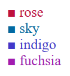

# Notas propias

## Cosas e ideas a implementar

- armar otro proyecto RAC-B para copiar las vistas que sirvan pero que sea el espacio para que interactue Bedelia. Cambiar en la paleta el color principal &#9632; "teal" para que sea muy visible el cambio de rol, por otro que puede ser:

    
        
- armar una vista para los nuevos inscriptos. Pregrado * (formulario de carga de preinscripcion)

## cosas a tener en cuenta
- cambiar todos los usuarios a DNI ver de implementarlo Diciembre 2025 o Febrero 2026
- seguir trabajando en las inscripciones a instrumento.
