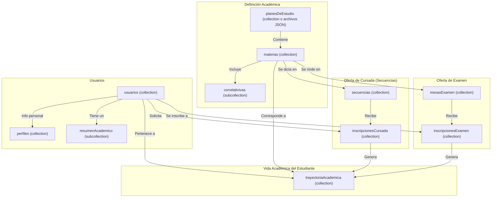

# Diagrama de Firestore v2 - SIGE (Propuesta Revisada)

Esta versión incorpora la lógica de secuencias, mesas de examen y una trayectoria académica detallada.

## Diagrama Mermaid

## Descripción de Colecciones

### `usuarios/{usuarioId}`
- **Propósito**: Datos de autenticación y de acceso frecuente.
- **Campos**: `nombre`, `apellido`, `dni`, `email`, `roles: ['estudiante']`, `planEstudioId`.

#### `usuarios/{uid}/resumenAcademico/{materiaId}`
- **Propósito**: Subcolección desnormalizada para mostrar rápidamente las materias aprobadas en el tablero del estudiante. Se actualiza automáticamente (vía Cloud Function) desde `trayectoriaAcademica`.
- **Campos**: `nombreMateria`, `notaFinal`, `fechaAprobacion`, `condicion`.

### `perfiles/{usuarioId}`
- **Propósito**: Datos administrativos y de acceso poco frecuente.
- **Campos**: `fechaNacimiento`, `domicilios: []`, `telefonos: []`, `datosLaborales: {}`.

### `planesDeEstudio/{planId}`
- **Propósito**: Catálogo de planes de estudio.
- **Campos**: `nombre`, `codigo`, `resolucion`.

### `materias/{materiaId}`
- **Propósito**: Catálogo de materias.
- **Campos**: `nombre`, `codigo`, `planes: ['planId1', 'planId2']`, `correlativas: []`.

### `secuencias/{secuenciaId}`
- **Propósito**: Representa la "secuencia" de una materia en un ciclo lectivo. La unidad a la que el alumno se inscribe para cursar.
- **Campos**: `materiaId`, `cicloLectivo`, `nombreSecuencia: "Secuencia A"`, `cupo`, `docenteId`, `horarios: []`, `periodoInscripcion: {inicio, fin}`.

### `inscripcionesCursada/{inscripcionId}`
- **Propósito**: Registro de la solicitud de un estudiante a una `secuencia`. Clave para el tablero del bedel.
- **Campos**: `estudianteId`, `secuenciaId`, `materiaId`, `cicloLectivo`, `estado: "solicitada" | "confirmada" | "rechazada"`, `fechaSolicitud`.

### `mesasExamen/{mesaId}`
- **Propósito**: Define una mesa de examen final para una materia.
- **Campos**: `materiaId`, `fechaExamen`, `tipo: "regular" | "libre"`, `periodoInscripcion: {inicio, fin}`.

### `inscripcionesExamen/{inscripcionId}`
- **Propósito**: Registro de la inscripción de un estudiante a una `mesaExamen`.
- **Campos**: `estudianteId`, `mesaId`, `materiaId`, `estado: "inscripto" | "ausente" | "aprobado"`.

### `trayectoriaAcademica/{intentoId}`
- **Propósito**: Log detallado de cada intento de un estudiante por aprobar una materia.
- **Campos**:
  - `estudianteId`
  - `materiaId`
  - `tipoIntento`: `"cursada" | "examen_regular" | "examen_libre" | "equivalencia"`
  - `referenciaId`: (ID del documento en `inscripcionesCursada` o `inscripcionesExamen` que originó este evento)
  - `resultado`: Objeto con el desenlace. Ej: `{ estado: 'regular', notaCursada: 6 }` o `{ estado: 'aprobado', notaFinal: 8 }`
  - `fecha`: Timestamp del evento.