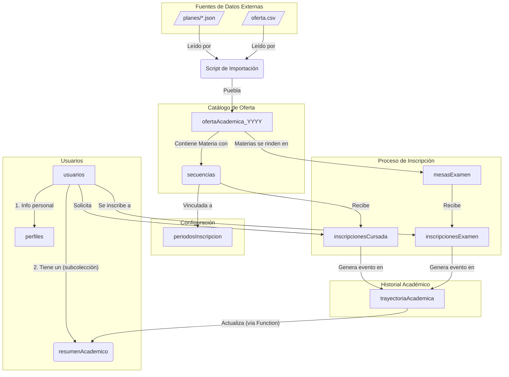

# Diagrama de Firestore + Archivos.JSON v3  - SIGE 

Esta versión incorpora la lógica de secuencias, 
mesas de examen y una trayectoria académica detallada.
Deja los datos de los planes en archivos JSON: "plan_id.json", 
para su visibilidad publica y el consumo sin lecturas a Firestore.

## Diagrama Maestro Unificado

### Explicación del Diagrama Maestro

Este diagrama muestra el flujo completo de datos y la arquitectura de la base de datos:

1.  **Flujo de Importación:** A la izquierda, las fuentes de datos (`planes/*.json` y `oferta.csv`) son leídas por el `Script de Importación`, que se encarga de analizar, combinar y poblar la colección `ofertaAcademica_YYYY`.

2.  **Estructura de la Oferta:** El script crea la oferta académica para un año. Cada `Materia` es un documento dentro de `ofertaAcademica_YYYY`, y cada una contiene una subcolección de `secuencias` (las comisiones o cursos específicos).

3.  **Relación con Períodos:** Cada `secuencia` está vinculada a un documento en la colección `periodosInscripcion`, lo que permite gestionar de forma centralizada las fechas de apertura y cierre de las inscripciones.

4.  **Estructura de Usuarios:** Se mantiene la separación entre `usuarios` (datos de login), `perfiles` (datos personales) y `resumenAcademico` (un resumen de notas para acceso rápido).

5.  **Flujo de Inscripciones:** Un `usuario` se inscribe a una `secuencia`, creando un documento en `inscripcionesCursada`. De forma similar, se inscribe a `mesasExamen`. Ambos tipos de inscripción generan un evento que se registra en la `trayectoriaAcademica`.

6.  **Ciclo de Retroalimentación:** La `trayectoriaAcademica` es la fuente de verdad del historial del alumno. Una Cloud Function se activa ante cualquier cambio en esta colección y actualiza el `resumenAcademico` del estudiante, asegurando que el tablero del alumno siempre muestre la información más reciente sin necesidad de consultas complejas.

## Descripción de Colecciones

### `usuarios/{usuarioId}`
- **Propósito**: Datos de autenticación y de acceso frecuente.
- **Campos**: `nombre`, `apellido`, `dni`, `email`, `roles: ['estudiante']`, `planEstudioId`.

#### `usuarios/{uid}/resumenAcademico/{materiaId}`
- **Propósito**: Subcolección desnormalizada para mostrar rápidamente las materias aprobadas. Se actualiza automáticamente (vía Cloud Function) desde `trayectoriaAcademica`.
- **Campos**: `nombreMateria`, `notaFinal`, `fechaAprobacion`, `condicion`.

### `perfiles/{usuarioId}`
- **Propósito**: Datos administrativos y de acceso poco frecuente.
- **Campos**: `fechaNacimiento`, `domicilios: []`, `telefonos: []`, `datosLaborales: {}`.

### `planesDeEstudio` (Archivos JSON)
- **Fuente**: `/public/planes/*.json`
- **Propósito**: Catálogo de planes y sus materias. La fuente de verdad para la definición de cada materia (nombre, correlativas, etc.). Son consumidos por el script de importación y por el cliente.

### `periodosInscripcion/{periodoId}`
- **Propósito**: Define las ventanas de tiempo para las inscripciones (ej: "Inscripción Febrero 2026 - Instrumentos").
- **Campos**: `nombre`, `fechaApertura`, `fechaCierre`, `activo`.

### `ofertaAcademica_YYYY/{materiaId}`
- **Propósito**: Contiene cada materia que se ofrece en un año lectivo. Los datos de la materia se toman de los JSON de planes para asegurar consistencia.
- **Campos**: `materiaId`, `nombre`, `planId`, `cursada`, etc.
- **Subcolecciones**: `secuencias`.

#### `ofertaAcademica_YYYY/{materiaId}/secuencias/{secuenciaId}`
- **Propósito**: Representa la comisión específica de una materia a la que el alumno se inscribe para cursar.
- **Campos**: `id`, `horario`, `aula`, `docente`, `cupo`, `periodoId` (vincula al documento correspondiente en `periodosInscripcion`).

### `inscripcionesCursada/{inscripcionId}`
- **Propósito**: Registro de la solicitud de un estudiante a una `secuencia`. Clave para el tablero del bedel.
- **Campos**: `estudianteId`, `secuenciaId`, `materiaId`, `estado: "solicitada" | "confirmada" | "rechazada"`, `motivoRechazo`, `fechaSolicitud`.

### `mesasExamen/{mesaId}`
- **Propósito**: Define una mesa de examen final para una materia.
- **Campos**: `materiaId`, `fechaExamen`, `tipo: "regular" | "libre"`, `periodoInscripcion: {inicio, fin}`.

### `inscripcionesExamen/{inscripcionId}`
- **Propósito**: Registro de la inscripción de un estudiante a una `mesaExamen`.
- **Campos**: `estudianteId`, `mesaId`, `materiaId`, `estado: "inscripto" | "ausente" | "aprobado"`.

### `trayectoriaAcademica/{intentoId}`
- **Propósito**: Log detallado de cada intento de un estudiante por aprobar una materia.
- **Campos**: `estudianteId`, `materiaId`, `tipoIntento`, `referenciaId`, `resultado`, `fecha`.